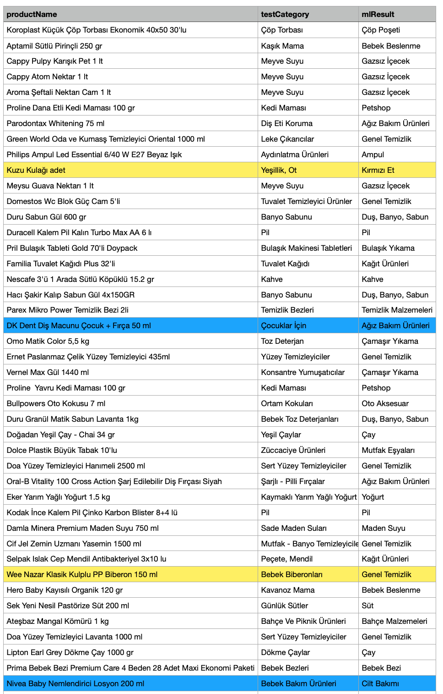
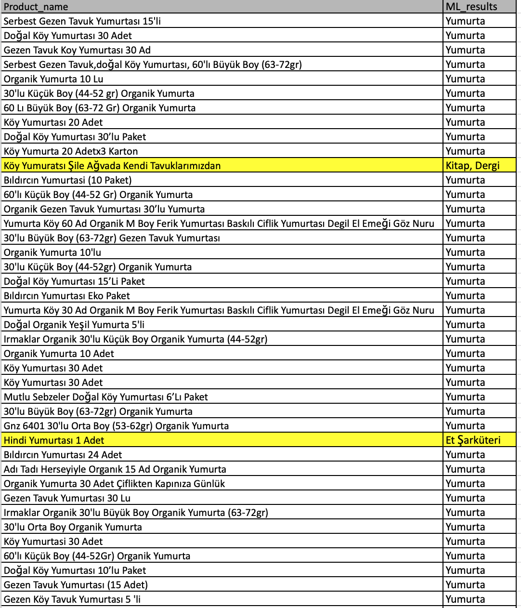

# Harizmi

Harizmi, Popüler bir eticaret sitesi üzerinde karşılaşılan sorunları çözmek için geliştirimliş bir makina öğrenmesidir. Veri olarak şuan online satış yapan web sitelerden web scraping yapılarak elde edildi.

## Amaçlar

* Yanlış kategorilendirilmiş ürünlerin önüne geçip kaliteyi artırmak.
* Yanlış fiyatta ürün paylaşmasını engeleyip müşteri memnuniyeti artırmak.

## Yanlış kategori

## Yanlış fiyat

## Sonuç

Makina öğrenmesini test etmek için e-ticaret sitesi üzerinden ürünler çekildi.

# Author
- [@FurkanSrtc](https://github.com/FurkanSrtc)
- [@oguzhanozdmr](https://github.com/oguzhanozdmr)
